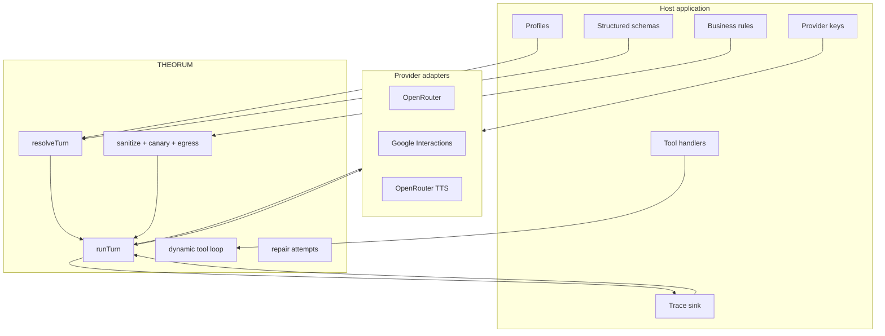
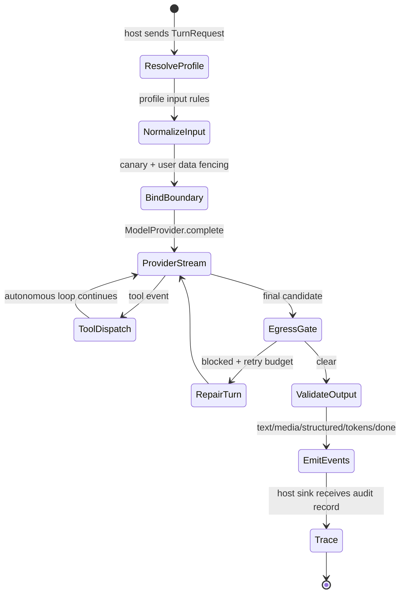

```text
 _______  __   __  _______  _______  ______    __   __  __   __
|       ||  | |  ||       ||       ||    _ |  |  | |  ||  |_|  |
|_     _||  |_|  ||    ___||   _   ||   | ||  |  | |  ||       |
  |   |  |       ||   |___ |  | |  ||   |_||_ |  |_|  ||       |
  |   |  |       ||    ___||  |_|  ||    __  ||       ||       |
  |   |  |   _   ||   |___ |       ||   |  | ||       || ||_|| |
  |___|  |__| |__||_______||_______||___|  |_||_______||_|   |_|
```

# THEORUM: The Flat Agent Kernel

> **"Profiles describe the contract. Providers move bytes. The runner enforces the turn."**

THEORUM is a compact TypeScript agent kernel for apps that need deterministic agent execution without embedding product logic inside the runtime. It gives a host application one runner, typed profiles, multimodal input normalization, dynamic tool dispatch, provider adapters, trace sinks, and guardrail hooks.

The package is intentionally **not** an agent product. It ships no app profiles, no prompts, no secrets, no database policy, no business rules, and no channel-specific UX. Those belong in the host application.

---

## Core Principles

```toml
[kernel_contract]
profiles = "Host-owned declarations for model, inputs, outputs, tools, and guardrails"
runner = "Single deterministic execution path for one agent turn"
providers = "Adapters for OpenRouter-compatible chat and Google Interactions"
tools = "Profile allowlist ceiling plus per-turn dynamic declarations"
egress = "Typed host hook for outbound disclosure checks and repair loops"
traces = "Host-injected sinks; no environment variables or bundled destinations"

[non_goals]
app_profiles = "No bundled assistants, demos, product personas, or business tasks"
secrets = "No .env files, no ambient key reads in the kernel"
realtime_voice = "Not included yet; persistent duplex sessions stay host-owned"
product_copy = "No channel wording, refusal copy, iMessage/Alexa/Web policy, or UX defaults"
```

---

## Architecture

THEORUM is organized around a deliberately small execution boundary.



### Turn Lifecycle



---

## Install

### Deno / JSR

```bash
deno add jsr:@theorum/core
```

```ts
import { defineProfile, registerProfile, runTurn } from "jsr:@theorum/core";
```

### npm

```bash
npm install theorum
```

```ts
import { defineProfile, registerProfile, runTurn } from "theorum";
```

---

## Minimal Example

This example uses a local mock provider so it runs without secrets. Real provider keys should be passed into the provider adapter by the host application.

```ts
import {
  defineProfile,
  registerProfile,
  runTurn,
  type ModelProvider,
  type TurnEvent,
} from "jsr:@theorum/core";

const profile = defineProfile({
  id: "assistant.basic",
  identity: {
    handle: "assistant",
    system: "Answer plainly.",
  },
  model: {
    protocol: "openAi",
    provider: "openrouter",
    allow: ["gemini35FlashLite"],
    thinking: "minimal",
    maxSteps: 1,
  },
  outputs: {
    streaming: { streamThoughts: false },
  },
  guardrails: {
    quota: { perDay: 100 }, // Optional. Omit when the host owns metering.
  },
});

registerProfile(profile);

const provider: ModelProvider = {
  async *complete(): AsyncIterable<TurnEvent> {
    yield { type: "text", text: "The turn completed." };
    yield { type: "tokens", tokens: { input: 8, output: 4, total: 12 } };
    yield { type: "done" };
  },
};

for await (const event of runTurn(
  { profile: "assistant.basic", input: { text: "Ping" } },
  provider,
)) {
  console.log(event);
}
```

---

## Dynamic Tools

THEORUM separates tool concerns into three layers.

| Layer | Owner | Purpose |
| :--- | :--- | :--- |
| **Access** | Profile | Hard ceiling: the agent cannot use a tool outside `profile.tools.allow`. |
| **Visibility** | Turn request | Per-turn declarations: T0/T1/T2 schemas can be passed or loaded dynamically. |
| **Permission** | Host app | `auto`, `session_consent`, and `always_confirm` determine whether execution pauses. |

```ts
const dynamicTools = [
  {
    name: "lookup_order",
    description: "Fetch order state from the host application.",
    loadTier: "T1",
    permissionTier: "session_consent",
    parameters: {
      type: "object",
      properties: { orderId: { type: "string" } },
      required: ["orderId"],
    },
    handler: async (args) => ({
      status: "ok",
      finding: "Order is in transit.",
      data: { orderId: args.orderId, state: "in_transit" },
    }),
  },
] as const;
```

The host owns the handler and authorization state. The kernel only enforces the declared contract.

---

## Guardrails and Egress

Inbound and outbound safety are generic kernel hooks.

```ts
const guardedProfile = defineProfile({
  id: "assistant.guarded",
  model: { allow: ["gemini35FlashLite"] },
  guardrails: {
    egress: {
      onBlock: "reject_to_agent",
      maxRetries: 2,
      enforce: ({ text, canary }) => {
        if (canary && text.includes(canary)) {
          return {
            blocked: true,
            text: "",
            hits: ["canary_token_leak"],
            rejectionMessage: "Remove private runtime tokens from the reply.",
          };
        }
        return { blocked: false, text };
      },
    },
  },
});
```

The egress function is host-owned. One application may block internal tool names, another may block regulated disclosures, and another may disable egress entirely for a trusted development profile.

Quota is optional. If a profile omits `guardrails.quota`, the quota helper returns `not_configured` so the host can decide whether that route should be unmetered, rejected, or handled by a separate rate limiter.

---

## Provider Adapters

THEORUM includes provider adapters but does not own credentials.

```ts
import { createOpenRouterProvider } from "jsr:@theorum/core/openrouter";

const provider = createOpenRouterProvider({
  apiKey: hostSecrets.openRouterApiKey,
  siteName: "Your app",
  siteUrl: "https://example.com",
});
```

```ts
import { createInteractionsProvider } from "jsr:@theorum/core/providers";

const provider = createInteractionsProvider({
  keys: hostGeminiKeyVault,
  fetch,
});
```

Provider support is intentionally split by wire protocol:

| Provider | Protocol | Use |
| :--- | :--- | :--- |
| OpenRouter | `openAi` | Chat completions, reasoning streams, tool calls, structured output, TTS gateway. |
| Google Interactions | `geminiInteractions` | Native Google Interactions streaming, image response format, interaction continuity, grounding metadata. |

---

## Public Entrypoints

| Entrypoint | Purpose |
| :--- | :--- |
| `jsr:@theorum/core` / `theorum` | Main kernel API: profiles, schemas, runner, core types, provider constructors. |
| `jsr:@theorum/core/kernel` / `theorum/kernel` | Profile, turn, event, tool, egress, provider, and schema types. |
| `jsr:@theorum/core/providers` / `theorum/providers` | Provider constructors and provider utility types. |
| `jsr:@theorum/core/openrouter` / `theorum/openrouter` | OpenRouter payload and streaming adapter. |
| `jsr:@theorum/core/guardrails` / `theorum/guardrails` | Sanitization, public error mapping, inbound injection/sensitive-data primitives. |
| `jsr:@theorum/core/observability` / `theorum/observability` | Trace sinks and trace record helpers. |

Internal files remain present in source for maintainability, but package consumers should use the public entrypoints above.

---

## Development

```bash
npm install
npm run test
npm run lint
deno publish --dry-run --allow-dirty
```

Build the npm package from the Deno source:

```bash
npm run build:npm
cd npm
npm pack
```

---

## Package Boundary

THEORUM is ready for host applications when these statements stay true:

```toml
[boundary]
profiles_in_package = false
env_files_in_package = false
ambient_secret_reads = false
business_logic_in_kernel = false
provider_keys_host_owned = true
trace_sinks_host_injected = true
realtime_duplex_voice = "out of scope"
```

If an app needs domain rules, platform delivery policy, product copy, database access, or session memory, that belongs outside THEORUM.

---

## License

MIT License. Copyright (c) ORCHID AI LLC.
