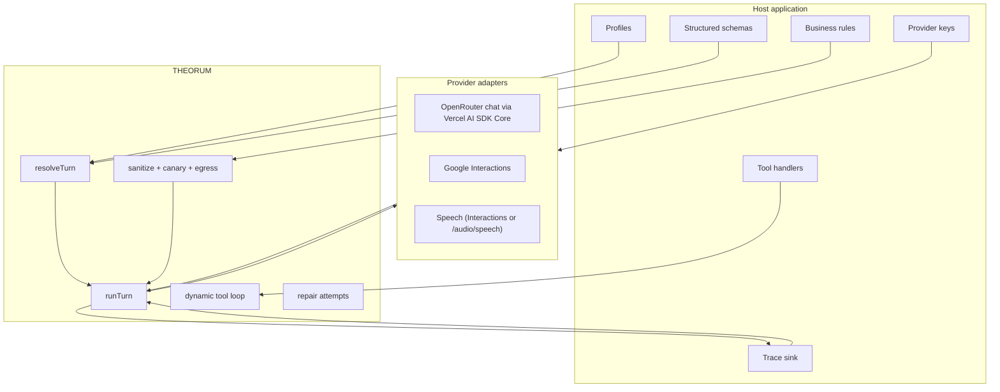
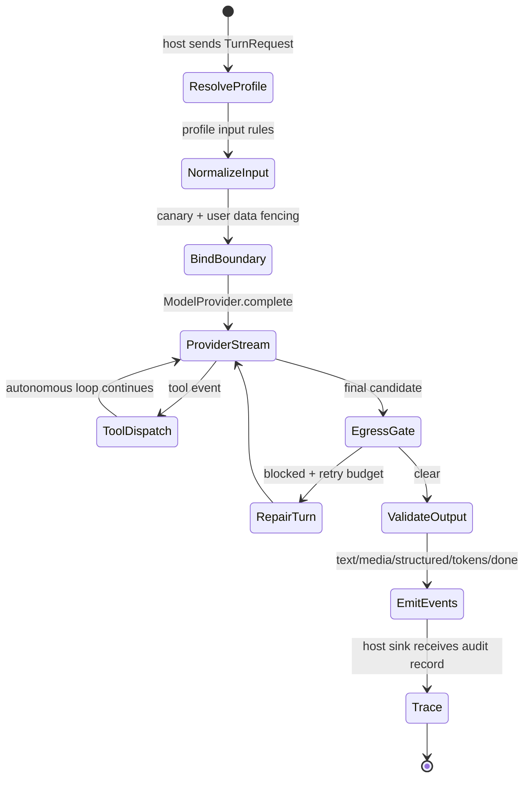

```text
 _______  __   __  _______  _______  ______    __   __  __   __
|       ||  | |  ||       ||       ||    _ |  |  | |  ||  |_|  |
|_     _||  |_|  ||    ___||   _   ||   | ||  |  | |  ||       |
  |   |  |       ||   |___ |  | |  ||   |_||_ |  |_|  ||       |
  |   |  |       ||    ___||  |_|  ||    __  ||       ||       |
  |   |  |   _   ||   |___ |       ||   |  | ||       || ||_|| |
  |___|  |__| |__||_______||_______||___|  |_||_______||_|   |_|
```

# THEORUM: The Flat Agent Kernel

**Current release: `0.1.15`** (`jsr:@theorum/core` / npm `theorum`).

> **"Profiles describe the contract. Providers move bytes. The runner enforces the turn."**

THEORUM is a compact TypeScript agent kernel for apps that need deterministic agent execution without embedding product logic inside the runtime. It gives a host application one runner, typed profiles, multimodal input normalization, dynamic tool dispatch, provider adapters, trace sinks, and guardrail hooks.

The package is intentionally **not** an agent product. It ships no app profiles, no prompts, no secrets, no database policy, no business rules, and no channel-specific UX. Those belong in the host application.

OpenRouter chat transport is powered by Vercel AI SDK Core under the adapter. THEORUM keeps the runner contract, guardrails, tool permissions, egress, media buffering, and trace event shape; AI SDK handles the OpenRouter request/stream/tool-call normalization layer.

---

## Core Principles

```toml
[kernel_contract]
profiles = "Host-owned declarations for model, inputs, outputs, tools, and guardrails"
runner = "Single deterministic execution path for one agent turn"
providers = "createProvider routes protocol/provider; adapters stay internal"
tools = "Profile allowlist ceiling plus per-turn dynamic declarations"
egress = "Typed host hook for outbound disclosure checks and repair loops"
traces = "Host-injected sinks; no environment variables or bundled destinations"

[non_goals]
app_profiles = "No bundled assistants, demos, product personas, or business tasks"
secrets = "No .env files, no ambient key reads in the kernel"
realtime_voice = "Not included yet; persistent duplex sessions stay host-owned"
product_copy = "No channel wording, refusal copy, iMessage/Alexa/Web policy, or UX defaults"
```

---

## Architecture

THEORUM is organized around a deliberately small execution boundary.



Hosts bind transports with `createProvider(profile, { gemini, openRouter })`. One door; protocol/provider (and speech role) pick the adapter.

### Turn Lifecycle



---

## Install

### Deno / JSR

```bash
deno add jsr:@theorum/core
```

```ts
import { defineProfile, registerProfile, runTurn } from "jsr:@theorum/core";
```

### npm

```bash
npm install theorum
```

```ts
import { defineProfile, registerProfile, runTurn } from "theorum";
```

---

## Minimal Example

This example uses a local mock provider so it runs without secrets. Real provider keys should be passed into the provider adapter by the host application.

```ts
import {
  defineProfile,
  registerProfile,
  runTurn,
  type ModelProvider,
  type TurnEvent,
} from "jsr:@theorum/core";

const profile = defineProfile({
  id: "assistant.basic",
  identity: {
    handle: "assistant",
    system: "Answer plainly.",
  },
  model: {
    protocol: "openAi",
    provider: "openrouter",
    allow: ["hostFastModel"],
    config: {
      hostFastModel: {
        apiId: "perplexity/sonar",
        openRouterId: "perplexity/sonar",
        thinking: { on: "high", off: "minimal" },
        thinkingLevels: ["minimal", "low", "medium", "high"],
        summaries: { on: "auto", off: "none" },
        maxOutputTokens: 8192,
        temperature: 1,
        keyBuiltins: [],
      },
    },
    thinking: "minimal",
    maxSteps: 1,
  },
  outputs: {
    streaming: { streamThoughts: false },
  },
  guardrails: {
    quota: { perDay: 100 }, // Optional. Omit when the host owns metering.
  },
});

registerProfile(profile);

const provider: ModelProvider = {
  async *complete(): AsyncIterable<TurnEvent> {
    yield { type: "text", text: "The turn completed." };
    yield { type: "tokens", tokens: { input: 8, output: 4, total: 12 } };
    yield { type: "done" };
  },
};

for await (const event of runTurn(
  { profile: "assistant.basic", input: { text: "Ping" } },
  provider,
)) {
  console.log(event);
}
```

---

## Dynamic Tools

THEORUM separates tool concerns into three layers.

| Layer | Owner | Purpose |
| :--- | :--- | :--- |
| **Access** | Profile | Hard ceiling: the agent cannot use a tool outside `profile.tools.allow`. |
| **Visibility** | Turn request | Per-turn declarations: T0/T1/T2 schemas can be passed or loaded dynamically. |
| **Permission** | Host app | `auto`, `session_consent`, and `always_confirm` determine whether execution pauses. |

```ts
const dynamicTools = [
  {
    name: "lookup_order",
    description: "Fetch order state from the host application.",
    loadTier: "T1",
    permissionTier: "session_consent",
    parameters: {
      type: "object",
      properties: { orderId: { type: "string" } },
      required: ["orderId"],
    },
    handler: async (args) => ({
      status: "ok",
      finding: "Order is in transit.",
      data: { orderId: args.orderId, state: "in_transit" },
    }),
  },
] as const;
```

The host owns the handler and authorization state. The kernel only enforces the declared contract.

---

## Guardrails and Egress

Inbound and outbound safety are generic kernel hooks.

```ts
const guardedProfile = defineProfile({
  id: "assistant.guarded",
  model: {
    allow: ["hostFastModel"],
    config: {
      hostFastModel: {
        apiId: "perplexity/sonar",
        openRouterId: "perplexity/sonar",
        thinking: { on: "high", off: "minimal" },
        thinkingLevels: ["minimal", "low", "medium", "high"],
        summaries: { on: "auto", off: "none" },
        maxOutputTokens: 8192,
        temperature: 1,
        keyBuiltins: [],
      },
    },
  },
  guardrails: {
    egress: {
      onBlock: "reject_to_agent",
      maxRetries: 2,
      enforce: ({ text, canary }) => {
        if (canary && text.includes(canary)) {
          return {
            blocked: true,
            text: "",
            hits: ["canary_token_leak"],
            rejectionMessage: "Remove private runtime tokens from the reply.",
          };
        }
        return { blocked: false, text };
      },
    },
  },
});
```

The egress function is host-owned. One application may block internal tool names, another may block regulated disclosures, and another may disable egress entirely for a trusted development profile.

Quota is optional. If a profile omits `guardrails.quota`, the quota helper returns `not_configured` so the host can decide whether that route should be unmetered, rejected, or handled by a separate rate limiter.

---

## Provider Adapters

THEORUM includes provider adapters but does not own credentials. Bind them with one door:

```ts
import { createProvider, runTurn } from "jsr:@theorum/core";

const provider = createProvider(profile, {
  gemini: { vault: hostGeminiKeyVault, fetch },
  openRouter: { apiKey: hostSecrets.openRouterApiKey },
  // openAi + local — optional; default baseUrl http://127.0.0.1:11434
  local: { baseUrl: hostResolvedLocalBaseUrl },
});

for await (const event of runTurn({ profile: profile.id, input: { text: "…" } }, provider)) {
  // …
}
```

`createProvider` routes from `profile.model.protocol` / `provider`. Speech roles use the same call — Interactions when Google, `/audio/speech` when openAi/openrouter (same `openRouter` credentials).

| Profile | Transport |
| :--- | :--- |
| `geminiInteractions` + `google` | Google Interactions (chat, image, speech) |
| `openAi` + `openrouter` (chat) | OpenRouter chat completions |
| `openAi` + `openrouter` (speech role) | OpenRouter `/audio/speech` |
| `openAi` + `local` | Local OpenAI-compatible `/v1/chat/completions` (Ollama, llama.cpp, vLLM, LM Studio, …) |

Local adapters take an optional `baseUrl` (default `http://127.0.0.1:11434`). THEORUM does not read `OLLAMA_HOST`; hosts that honor that env should resolve it and pass `local.baseUrl`. History `parts` (including images) are mapped on the wire; `done` events include a normalized `stop` from the OpenAI `finish_reason`.

OpenRouter uses Vercel AI SDK Core inside THEORUM's provider adapter. That stack
loads **lazily on the first `complete` call** for `openAi` + `openrouter` chat —
not when importing THEORUM, and not for Google or local providers. The adapter
still emits THEORUM `TurnEvent` values and preserves raw provider evidence for
citations/provenance where the normalized SDK stream does not expose enough detail.
Use `createProvider` for all OpenRouter turns; the adapter and payload helpers
stay internal to the providers package.

---

## Public Entrypoints

| Entrypoint | Purpose |
| :--- | :--- |
| `jsr:@theorum/core` / `theorum` | Main kernel API: profiles, schemas, runner, core types, provider constructors. |
| `jsr:@theorum/core/kernel` / `theorum/kernel` | Profile/turn types, tool catalog, `requireModelSpec`, thinking clamps over host model maps. |
| `jsr:@theorum/core/providers` / `theorum/providers` | `createProvider` + Gemini vault types. |
| `jsr:@theorum/core/guardrails` / `theorum/guardrails` | Sanitization, public error mapping, inbound injection/sensitive-data primitives. |
| `jsr:@theorum/core/observability` / `theorum/observability` | Trace sinks and trace record helpers. |
| `jsr:@theorum/core/host` / `theorum/host` | Optional Deno HTTP helpers (`json`, status mapping, cutout mint flush). |
| `jsr:@theorum/core/cli` / `theorum/cli` | Profile inspection and stress-test CLI (`theorum` binary on npm). |
| `jsr:@theorum/core/presets` / `theorum/presets` | Optional convenience packs (`registerGooglePreset`, …). |
| `jsr:@theorum/core/presets/google` / `theorum/presets/google` | Google builtins (search/maps/urlContext/codeExecution) + Interactions/OpenRouter wire metadata. |

Internal files remain present in source for maintainability, but package consumers should use the public entrypoints above.

### Exported API (`mod.ts`)

Named exports from the root barrel (same symbols hosts get from `theorum` /
`jsr:@theorum/core`):

| Group | Symbols |
| --- | --- |
| Guardrails errors | `describeError`, `isAbortError`, `publicError`, `TheorumError`, `throwIfAborted`, `toErrorEvent` |
| Quota | `QuotaSlotStatus`, `clientIp`, `quotaMessage`, `releaseSlot`, `resetSlots`, `skipQuota`, `takeSlot` |
| Sanitize | `PROJECT_ID_MAX`, `sanitizeProjectId`, `sanitizeText`, `sanitizeTurnRequest` |
| Compaction | `CompactionSplit`, `CompactionTokens`, `compactionMeter`, `compactionNeeded`, `estimateHistoryTokens`, `HISTORY_MEDIA_TOKENS`, `HISTORY_TEXT_ENCODING`, `resolveCompactionTokens`, `resolveHistoryTokens`, `shouldCompact`, `splitForCompaction` |
| Runner | `runTurn` |
| Catalog | `CATALOG`, `clampThinkingLevel`, `clampThinkingLevelForApiId`, `mediaKindForMime`, `getTool`, `listBuiltinIds`, `mimeAllowed`, `mimeEssence`, `modelEntryByApiId`, `registerTools`, `requireModelSpec`, `resetTools` |
| Profiles | `ProfileDefinition`, `clearProfiles`, `defineProfile`, `getProfile`, `hasProfile`, `listProfiles`, `registerProfile`, `registerProfiles`, `projectProfile`, `resolveTurn` |
| Structured | `getStructured`, `registerStructured`, `executeTool` |
| Stop / resume | `ProfileResumeSpec`, `TurnContinueFrom`, `TurnStop`, `TurnStopKind`, `AUTO_CONTINUE_DELAY_MS`, `CONTINUE_INSTRUCTION`, `DEFAULT_AUTO_CONTINUE`, `GenerationStopError`, `isGenerationStopError`, `isResumeableStop`, `isUserCancelledStop`, `shouldAutoContinue`, `turnStopFromClientStreamEnd`, `turnStopFromInteractionStatus`, `turnStopFromOpenRouter` |
| Observability | `jsonlSink`, `memorySink`, `noopSink`, `resolveTraceDir`, `sinkFromDir`, `writeTrace`, `TraceRecord` |
| Providers | `CreateProviderOptions`, `GeminiTransport`, `GeminiVault`, `LocalProviderConfig`, `createLocalProvider`, `createProvider`, `DEFAULT_LOCAL_BASE_URL` |

Kernel types re-exported through this barrel follow `export type *` from
`src/kernel/types.ts` (see `src/kernel/CONTRACT.md`).

---

## Documentation

Package docs are co-located with each public export (plus this README for `.`):

| Doc | Export |
| :--- | :--- |
| [`src/kernel/CONTRACT.md`](src/kernel/CONTRACT.md) | `theorum/kernel` — profiles, runner, compaction, stop/resume |
| [`src/providers/CONTRACT.md`](src/providers/CONTRACT.md) | `theorum/providers` — `createProvider`, secrets boundary |
| [`src/guardrails/CONTRACT.md`](src/guardrails/CONTRACT.md) | `theorum/guardrails` |
| [`src/observability/CONTRACT.md`](src/observability/CONTRACT.md) | `theorum/observability` |
| [`src/host/CONTRACT.md`](src/host/CONTRACT.md) | `theorum/host` |
| [`src/cli/CONTRACT.md`](src/cli/CONTRACT.md) | `theorum/cli` |
| [`src/presets/CONTRACT.md`](src/presets/CONTRACT.md) | `theorum/presets` |
| [`src/presets/GOOGLE.md`](src/presets/GOOGLE.md) | `theorum/presets/google` |

Document health is enforced by `npm run lint:docs` — the **first** step of
`npm run lint` / `deno task lint` (`docs/_map.mjs`):

- Full production-file ownership (`mod.ts`, `src/**/*.ts`, `package.json`, docs-truth scripts)
- Export parity with `package.json` and export-drift vs entry `mod.ts` files
- Doc + **section** freshness on every code change (no Export-only gaming)
- Behavioral sections require `contract_test` evidence (≥2 supports each)
- Pre-commit runs `lint:docs` automatically (`prepare` installs the hook on `npm install`)

---

## Development

```bash
npm install
npm run test
npm run lint
deno publish --dry-run --allow-dirty
```

Run the packaged CLI locally:

```bash
deno task theorum --help
# or after npm install -g / npx:
# npx theorum --help
```

Build the npm package from the Deno source (publish only from `npm/`):

```bash
npm run build:npm
cd npm
npm pack
```

Run a live OpenRouter smoke test with a host-resolved key. The key is passed as an argument and is never read from a Theorum `.env` file.

```bash
deno run --allow-net scripts/verify-live.ts --api-key "$OPENROUTER_API_KEY"
```

The default live verifier uses `perplexity/sonar` because it is broadly available on OpenRouter. Hosts can override both the profile-facing model id and provider-native id:

```bash
deno run --allow-net scripts/verify-live.ts \
  --api-key "$OPENROUTER_API_KEY" \
  --model hostFastModel \
  --api-id perplexity/sonar
```

---

## Package Boundary

THEORUM is ready for host applications when these statements stay true:

```toml
[boundary]
profiles_in_package = false
env_files_in_package = false
ambient_secret_reads = false
business_logic_in_kernel = false
provider_keys_host_owned = true
trace_sinks_host_injected = true
realtime_duplex_voice = "out of scope"
```

If an app needs domain rules, platform delivery policy, product copy, database access, or session memory, that belongs outside THEORUM.

---

## License

MIT License. Copyright (c) ORCHID AI LLC.

```theorum-evidence
{
  "sections": {
    "Core Principles": {
      "supports": [
        { "kind": "source", "path": "mod.ts" },
        { "kind": "contract_test", "path": "tests/kernel/theorum.test.ts" }
      ]
    },
    "Architecture": {
      "supports": [
        { "kind": "source", "path": "src/kernel/engine/runner.ts" },
        { "kind": "contract_test", "path": "tests/kernel/theorum.test.ts" }
      ]
    },
    "Public Entrypoints": {
      "supports": [
        { "kind": "config", "path": "package.json" },
        { "kind": "contract_test", "path": "scripts/docs-truth/graph.test.mjs" }
      ]
    },
    "Documentation": {
      "supports": [
        { "kind": "graph", "path": "docs/_map.mjs" },
        { "kind": "contract_test", "path": "scripts/docs-truth/graph.test.mjs" }
      ]
    },
    "Package Boundary": {
      "supports": [
        { "kind": "source", "path": "src/providers/create-provider.ts" },
        { "kind": "contract_test", "path": "tests/providers/create-provider.test.ts" }
      ]
    }
  }
}
```
